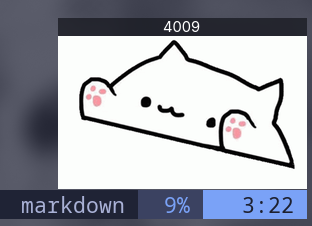

<p align="center">
  
  <h1 align="center">Bongo Cat 4 Linux</h1>
</p>

A native “Bongo Cat” overlay for Linux 
inspired by the Steam Bongo Cat plugin, but built from the ground up for GTK4/Layer Shell environments.
Bongo Cat 4 Linux listens for key-press events and shows an animated cat bonging on your screen.

---

## Features

- **Lightweight GTK4 + Layer Shell UI**  
  Frameless, always-on-top overlay anchored to the bottom-right corner.
- **Responsive Key Listening**  
  Watches `/dev/input/event*` devices and animates on key-down events.
- **Hit Counter with Persistence**  
  Displays total hits and stores the count in a SQLite database (`~/.config/bongo-cat/sqlite.db`).
- **Custom Assets**  
  Swap out `idle.png`, `hit_left.png`, and `hit_right.png` via the `BONGO_ASSETS` env var or `~/.config/bongo-cat/`.

---

## Requirements

- **Rust** (1.85+)  
- **GTK4** and **gtk4-layer-shell**  
- **evdev** (to read `/dev/input/event*`)  
  - dont forget the input user group (sudo usermod -aG input "$USER")
- **tokio** & **async-channel**  
- **limbo** (database)

## Build

```bash
cargo build --release
./target/release/bongo-cat
```
